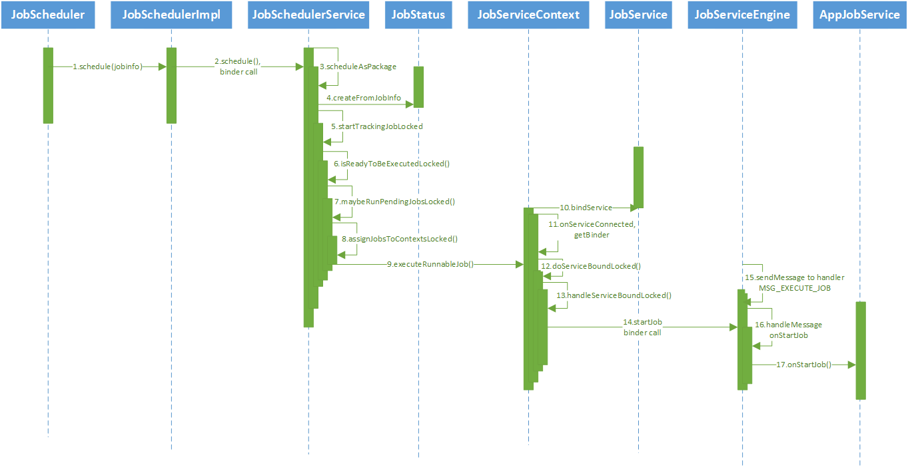

- The process of invoke jobScheduler#schedule(JobInfo info)

- Tip1: job constraint

    Every jobInfo must require at least one constraint. 

- Tip2: job id

    Every job id must be unique across all clients of the same uid not just the same package. 

- Tip3: jobScheduler#cancelAll

    Invoking this method will cancel all jobs for apps with same uid,not just the caller app.

- Tip4: jobService#onStartJob

    This method work on android main thread. You should put your operations in another thead.

- Tip5 

...

